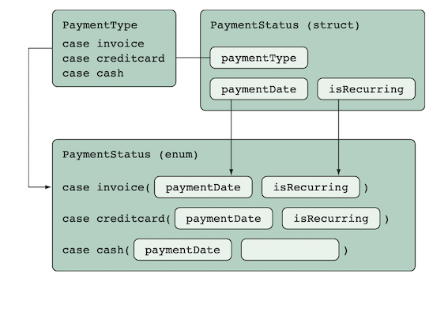

# Chapter 2. Enums

## 2.2.2. Turn Structure To Enum

- Choose *Enum* when data has mutually exclusive properties.

### Message Data:

```swift
enum Message {
    case text(userId: String, contents: String, date: Date)
    case draft(userId: String, date: Date)
    case join(userId: String, date: Date)
    case leave(userId: String, date: Date)
}

func getMessage(message: Message) {
    switch message {
        case let .text(_, contents, date):
            print("\(contents) , \(date)")
        case let .draft(userId, date):
            print("\(userId) , \(date)")
        default: print("other")
    }
    // use *if* where only one case needs to be checked:
     if case let .text(_, contents, _) = message {
        print("\(contents)")
    }
}
```

## 2.1.3. Chose Struct or Enum

- *enum* gives significant compiler advance
- frequency using only one case collation - use *Struct*
  
## 2.3.2. SuperClass or Enum

- Try use Enum instead of SuperClass when descendants might have exclusive properties, or properties from SuperClass are unnecessary in descendants.
  
```swift
enum Workout { // enum as SuperClass
    case run(Run) // class
    case cycle(Cycle) 
    case pushups(Pushups) 
}
```

## 2.4.1. Sum Types

- There are sum-types or OR-types and composition-types or AND-types.
- change AND-type(struct) to OR-type in order to avoid cases expanding.  


## 2.5.2. Strings collation. (Safety strings).

Not safety function check strings:

```swift
func iconName(for fileExtention: String) -> String {
    switch fileExtention {
        case "jpg": return "assetIconJpeg"
        case "bmp": return "assetIconBitmap" 
        case "gif": return "assetIconGif" 
        default: return "assetIconUnknown"
    }
}
```

the same function with enum-check:

```swift
func iconName(for fileExtension: String) -> String {
    guard let imageType = ImageType(rawValue: fileExtension) else { return "assetIconUnknown" } 
    switch imageType {
        case .jpg: return "assetIconJpeg" 
        case .bmp: return "assetIconBitmap" 
        case .gif: return "assetIconGif"
    } 
}
```

and an additional check, embedded in enum.

```swift
enum ImageType: String { 
    case jpg
    case bmp 
    case gif
    init?(rawValue: String) {
        switch rawValue.lowercased() {
            case "jpg", "jpeg": self = .jpg
            case "bmp", "bitmap": self = .bmp 
            case "gif", "gifv": self = .gif 
            default: return nil
        } 
    }
}
```

## Conclusion:

- Use Enum as alternative to Class hierarchy or combine them. It makes the whole architecture more flexible.
- Use Enum to catch problems during compilation.
- Use Enum for property collections.
- Enum is a sum-type.
- Use Enum to distribute Struct.
- Use rawValues to check mistakes during compilation.
- Use Enum for string safety work.
  
---

# Chapter 3. Pure Properties.

Using lazy property:

``` swift
enum Level: Int {
    case elementary=1
    case preInter=2
    case inter=3
    case upperInter=4
    case advanced=5
}
struct LearningPlan {
    let level: Level
    var description: String
    
        lazy private(set) var contents: String = { //private(set) - impossible to change out of scope
        print("Im taking my sweet time to calculate.")
        sleep(2)
        switch level {
            case .elementary: return "Watch an English documentary."
            case .preInter: return "Translate a newspaper article "
            case .inter: return "Transcribe one song."
            case .upperInter: return "Listen to the radio"
            case .advanced: return "Talk English"
        }
    }() // pay attention here
}
```
## 3.3.2.
Set property mutating from init()
PROBLEM: How to call DidSet from Init()?
``` swift
struct Tweet {
    let author: String
    var message: String {
        didSet {
            message = message.trimmingCharacters(in: .whitespaces)
        }
    }
    init(author: String, message: String) {
        self.author = author
        self.message  = message
        
        // calling didSet here
        defer {self.message = message}
    }
}
```
